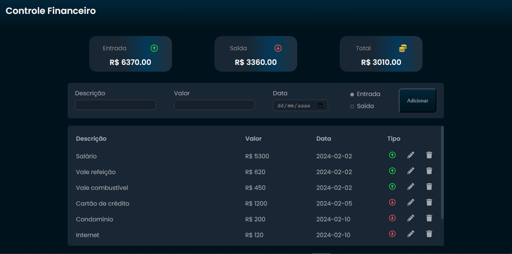

# Controle Financeiro Pessoal

## Descrição do projeto
- Como o próprio nome diz, o projeto trata-se de uma aplicação de controle financeiro 
pessoal que armazena listas de valores recebidos e pagos, fáz os cálculos e mostra o total de entrada, saída e 
o restante total. Um CRUD Fullstack com React.js Node e MySQL.
 

- Este é um projeto de estudos no qual a necessidade de evolução me fizeram querer sair da zona de conforto e aprender como desenvolver uma aplicação mais completa, que além da parte visual e de interação também trouxesse a parte de tratamento e armazenamento de dados
do lado do servidor.

## Ferramentas usadas
#### Front-end
- [VScode](https://code.visualstudio.com/)
- [npm](https://www.npmjs.com/)
- [React.js](https://react.dev/) + [Vite](https://vitejs.dev/)
- [Styled Components](https://styled-components.com/)
- [Axios](https://axios-http.com/ptbr/docs/intro)
- [Google Fonts](https://fonts.google.com/)
- [Font Awesome](https://fontawesome.com/) 
- [React Icons](https://react-icons.github.io/react-icons/)

#### Back-end
- [npm](https://www.npmjs.com/)
- [Node.js](https://nodejs.org/en)
- [Nodemon](https://nodemon.io/)
- [Express.js](https://expressjs.com/pt-br/)
- [Axios](https://axios-http.com/ptbr/docs/intro)
- [Cors]()
- [MySql](https://www.mysql.com/)
- [Nodemon]()

## Funções hooks e métodos usados
- getList()
- handleInput()
- addList()
- updateList()
- handleEdit()
- onDelete()
- useState()
- useEffect() 
- Map()
- Filter()
- Reduce()
- toFixed()
- Math.abs()

### getList() :
- A função getList faz a requisição de leitura da tabela no banco de dados através do servidor, recebe os dados 
e manda para a variável de estado controlado transactionsList.
- Em seguida, foram usados os metodos filter e map para filtrar as entradas e saídas através 
da comparação do item.expense.
Com as entradas e saídas definidas, usei os método reduce e toFixed para retornar 
os valores inteiros, definir as casas decimais e a função Math.abs que recebe o 
cálculo da entrada e saída e retorna o total de forma absoluta.

### useEffect() :
- O hook useEffect recebe a função getList e dispara a mesma assim que o sistema 
é inicializado ou quando o array de dependencias [transactionsList] é modificado.

### addList :
- A função addList recebe como parâmetro os novos dados a serem ineridos e adiciona 
o novo elemento ao array transactionsList.

### handleInput :
- Checa se todos os dados foram inseridos no formulário e se os dados 
inseridos são para edição ou inserção. Caso a checagem resulte em edição, a função updateList 
será chamada e será feita uma requisição axios.put para o servidor para alterar um ou mais itens desejados, caso contrário, será feito a  requisição para inserção
de uma nova lista através do axios.post.

### onDelete :
- Recebe o id da lista selecionada por parâmetro e faz a requisição axios.delete pelo id.

## Outros
- Condicional onChange
- Condicional onClick
- Condicional rendering
- Atributo de stilos 
- Design responsivo

## Back-end 
- No documento app foram criados as instãncias para uso das ferramentas express, cors e implementa as rotas para as funções de requisições.

- O arquivo servidor.js importa o app, cria e especifica a porta no qual o app será rodado.

- Na pasta database fica o arquivo db.js no qual foi criada uma instância contendo as informações para conexão com o banco de dados mysql e definida como exportação padrão para ser usado nas funções de requisições.

- A pasta controllers contém o documento TransactionController.js que rcebe as funções com os parametros recebidos e faz as requisições sql para o banco de dados db.js.

## Como Intalar
### Back-end
- Certifique-se de ter as ferramentas npm, node.js 18.17 e mysql 8.0 instaladas no seu sistema.
- Clone este reposítório, acesse a pasta backend e instale as dependências.
- Na pasta beackend, vá até a pasta database, abra o arquivo db.js e insira as configurações 
de conexão com o banco de dados ( user: e password:).
- No MySql Workbench crie um banco com o nome de db_trans, dentro dele crie uma tabela com o nome 
transactions e com as colunas id, desc, amount, date e expense.
- Para rodar o servidor abra o terminal na pasta backend e rode o comando npm start.

### Front-end
- Abra a pasta frontend e instale as dependências.
- Abra outra sessão no terminal, na pasta frontend digite o comando npm run dev.
- Abra o navegador no enderço destacado no terminal.

## Como usar
- No formulário insira os dados nos campos Descrição, Valor, Data, selecione o tipo "entrada ou saída" e clique no botão Adicionar.

- Para editar um ou mais itens da lista basta clicar no ícone de lápis na lista desejada, reescrever o item, depois clicar no botão Atualizar.

- Para excluir uma lista basta clicar no ícone de lixeira da mesma e confirmar os alertas.

## Minhas informações
[linkedin.com/in/edilanio-amaral](http://www.linkedin.com/in/edilanio-amaral)

### Se você tiver alguma dúvida ou feedback, sinta-se à vontade para abrir um issue neste repositório e ajude a melhorar com contribuições de resolução de bugs ou melhorias no projeto.

